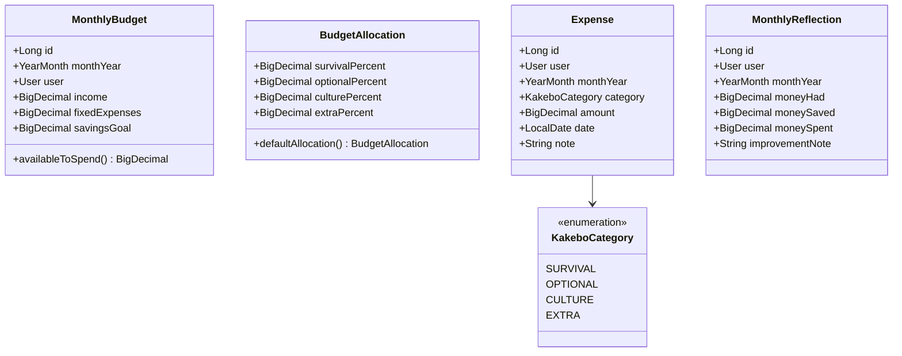

# MyKakebo

A framework-free Java 17 domain model and aggregation service for a personal budgeting app based on the Japanese Kakebo method. Models a monthly budget, categorizes expenses, and produces end-of-month spending and reflection data.

## Current status

The repository contains the first domain and aggregation slice: a Maven project with Java records, one service, and unit tests. Spring Boot, persistence, an HTTP API, and a frontend are planned but not implemented yet.

| Area                                   | Status      |
| -------------------------------------- | ----------- |
| Java 17 domain model                   | Implemented |
| Category aggregation and budget checks | Implemented |
| JUnit 5 unit tests                     | Implemented |
| Spring Boot application and REST API   | Planned     |
| PostgreSQL and persistence             | Planned     |
| React + TypeScript frontend            | Planned     |
| Docker, Kubernetes, and CI/CD          | Planned     |

## The Kakebo model



A monthly budget records `income`, `fixedExpenses`, and `savingsGoal`. `MonthlyBudget.availableToSpend()` calculates the amount left after fixed expenses and the savings goal:

```text
availableToSpend = income - fixedExpenses - savingsGoal
```

Each expense belongs to one of four categories:

| Category   | Intended use                                                            | Default allocation |
| ---------- | ----------------------------------------------------------------------- | -----------------: |
| `SURVIVAL` | Essentials such as rent, groceries, transport, insurance, and utilities |                50% |
| `OPTIONAL` | Discretionary spending such as dining out and entertainment             |                25% |
| `CULTURE`  | Books, courses, education, and other self-improvement                   |                15% |
| `EXTRA`    | Unplanned costs such as gifts, repairs, and unexpected expenses         |                10% |

`BudgetAllocation` validates that the four percentages sum to `1.0`, rejecting invalid splits at construction. `defaultAllocation()` provides the split shown above.

## Aggregation service

`SummaryService` contains the current framework-independent application logic:

- `spendByCategory` groups expenses and sums their amounts.
- `remainingByCategory` subtracts spending from the supplied category limits. Categories with no spending count as zero spent.
- `isOverBudget` reports whether any remaining category balance is negative.
- `buildReflection` creates a `MonthlyReflection` with total spending, money saved, and an optional warning when spending exceeds income.

`BudgetAllocation` supplies the percentages for category limits, but the current service does not yet expose a method that converts those percentages into limits.

The reflection currently calculates:

```text
moneySpent = sum(expense.amount)
moneySaved = income - fixedExpenses - moneySpent
```

The generated warning is `Warning: money spent exceeds income.` when total spending is greater than income. Reflection notes are otherwise `null` until a persistence or application layer is added.

## Project structure

```text
MyKakebo/
├── backend/
│   ├── pom.xml
│   └── src/
│       ├── main/java/com/aliciagar2/mykakebo/
│       │   ├── domain/       # Budget, expense, user, category, reflection records
│       │   └── service/      # SummaryService
│       └── test/java/...     # SummaryServiceTest
├── algorithms/               # Weekly DSA practice, see algorithms/README.md
├── frontend/                 # Reserved for the future React client
└── k8s/                      # Reserved for future deployment manifests
```

## API (target, not yet implemented)

```
POST   /api/auth/login
POST   /api/auth/register

GET    /api/months/{year}/{month}/budget
POST   /api/months/{year}/{month}/budget

GET    /api/months/{year}/{month}/expenses?category=
POST   /api/months/{year}/{month}/expenses
PUT    /api/expenses/{id}
DELETE /api/expenses/{id}

GET    /api/months/{year}/{month}/summary
GET    /api/months/{year}/{month}/reflection
POST   /api/months/{year}/{month}/reflection
GET    /api/months/history
```

## Requirements

- Java 17 or newer
- Maven 3.9 or newer, or a Maven wrapper if one is added later

No database, application server, Node.js installation, or external service is required for the current test suite.

## Run the tests

From the repository root:

```bash
cd backend
mvn test
```

The current suite covers category aggregation with empty, single-category, and multi-category inputs; remaining balances; numeric overspending checks; reflection totals and warnings; and both valid and invalid budget allocations. The suite is framework-free and currently contains 11 JUnit tests.

## Roadmap

1. Add Spring Boot configuration and application entry point.
2. Add persistence with JPA, PostgreSQL, and migrations.
3. Expose budget, expense, summary, reflection, and authentication REST endpoints.
4. Add the React + TypeScript client.
5. Add containerization, k3s manifests, integration tests, and CI/CD.

## Algorithms track

Weekly DSA practice, reusing the Kakebo dataset where it fits. See [`algorithms/README.md`](./algorithms/README.md).

## License

See [LICENSE](./LICENSE).

---

## Author

[Alicia García](https://github.com/AliciaGar2)
