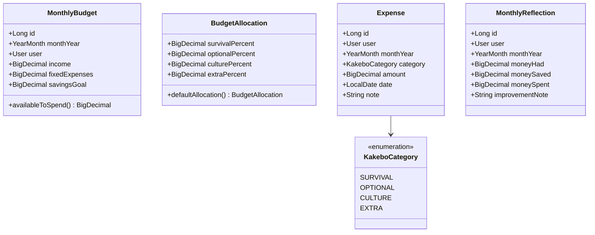

# MyKakebo

A framework-free Java 17 domain model and aggregation service for a personal budgeting app based on the Japanese Kakebo method. Models a monthly budget, categorizes expenses, and produces end-of-month spending and reflection data.

## Current status

The repository contains the domain/aggregation slice plus a minimal Spring Boot application: a Maven project with Java records, one aggregation service, a health endpoint, unit tests, and a multi-stage Dockerfile. Persistence, the full REST API, and a frontend are planned but not implemented yet.

| Area                                    | Status      |
| ----------------------------------------- | ----------- |
| Java 17 domain model                    | Implemented |
| Category aggregation and budget checks  | Implemented |
| JUnit 5 unit tests                      | Implemented |
| Spring Boot application skeleton        | Implemented |
| `/health` endpoint                      | Implemented |
| Multi-stage Dockerfile                  | Implemented |
| Persistence-backed REST API             | Planned     |
| PostgreSQL and persistence              | Planned     |
| React + TypeScript frontend             | Planned     |
| Kubernetes and CI/CD                    | Planned     |

## The Kakebo model



A monthly budget records `income`, `fixedExpenses`, and `savingsGoal`. `MonthlyBudget.availableToSpend()` calculates the amount left after fixed expenses and the savings goal:

```text
availableToSpend = income - fixedExpenses - savingsGoal
```

Each expense belongs to one of four categories:

| Category   | Intended use                                                            | Default allocation |
| ---------- | ----------------------------------------------------------------------- | -----------------: |
| `SURVIVAL` | Essentials such as rent, groceries, transport, insurance, and utilities |                50% |
| `OPTIONAL` | Discretionary spending such as dining out and entertainment             |                25% |
| `CULTURE`  | Books, courses, education, and other self-improvement                   |                15% |
| `EXTRA`    | Unplanned costs such as gifts, repairs, and unexpected expenses         |                10% |

`BudgetAllocation` validates that the four percentages sum to `1.0`, rejecting invalid splits at construction. `defaultAllocation()` provides the split shown above.

## Aggregation service

`SummaryService` contains the current framework-independent application logic:

- `spendByCategory` groups expenses and sums their amounts.
- `remainingByCategory` subtracts spending from the supplied category limits. Categories with no spending count as zero spent.
- `isOverBudget` reports whether any remaining category balance is negative.
- `buildReflection` creates a `MonthlyReflection` with total spending, money saved, and an optional warning when spending exceeds income.

`BudgetAllocation` supplies the percentages for category limits, but the current service does not yet expose a method that converts those percentages into limits.

The reflection currently calculates:

```text
moneySpent = sum(expense.amount)
moneySaved = income - fixedExpenses - moneySpent
```

The generated warning is `Warning: money spent exceeds income.` when total spending is greater than income. Reflection notes are otherwise `null` until a persistence or application layer is added.

## Spring Boot application

A minimal Spring Boot 4.1.1 application (`MykakeboApplication`) wraps the domain and service code above. It currently exposes one endpoint:

```
GET /health -> 200 OK, body "OK"
```

`HealthController` delegates to `HealthService`, injected via constructor. Both are plain Spring components with no dependency on persistence.

The application declares `spring-boot-starter-data-jpa` as a dependency (needed for upcoming JPA entities), but no `DataSource` is configured yet — there is no database or set of entities in the codebase. `application.yaml` excludes JPA and DataSource autoconfiguration explicitly:

```yaml
spring:
  autoconfigure:
    exclude:
      - org.springframework.boot.jdbc.autoconfigure.DataSourceAutoConfiguration
      - org.springframework.boot.autoconfigure.orm.jpa.HibernateJpaAutoConfiguration
```

This exclusion is temporary and will be removed once JPA entities and a PostgreSQL `DataSource` are added. An in-memory H2 database is present as a `test`-scoped dependency, used only so the Spring context can boot during `mvn test`; it is not present on the runtime classpath and is not a substitute for the PostgreSQL integration tests planned later with Testcontainers.

### Dockerfile

`backend/Dockerfile` builds the application as a two-stage image:

1. **Build stage** (`maven:3.9.11-eclipse-temurin-17-alpine`) compiles the project and packages the jar with `mvn clean package -DskipTests` (tests already run in a separate CI step).
2. **Runtime stage** (`eclipse-temurin:17-jre-alpine`) copies only the built jar from the build stage and runs it. The final image ships without Maven, the JDK compiler, or the source tree.

The image listens on port `8080`.

## Project structure

```text
MyKakebo/
├── backend/
│   ├── pom.xml
│   ├── Dockerfile
│   ├── mvnw, mvnw.cmd, .mvn/
│   └── src/
│       ├── main/java/com/aliciagar2/mykakebo/
│       │   ├── MykakeboApplication.java
│       │   ├── domain/       # Budget, expense, user, category, reflection records
│       │   ├── service/      # SummaryService, HealthService
│       │   └── web/          # HealthController
│       ├── main/resources/
│       │   └── application.yaml
│       └── test/java/...     # SummaryServiceTest, MykakeboApplicationTests
├── algorithms/               # Weekly DSA practice, see algorithms/README.md
├── frontend/                 # Reserved for the future React client
└── k8s/                      # Reserved for future deployment manifests
```

## API (target, not yet implemented)

```
POST   /api/auth/login
POST   /api/auth/register

GET    /api/months/{year}/{month}/budget
POST   /api/months/{year}/{month}/budget

GET    /api/months/{year}/{month}/expenses?category=
POST   /api/months/{year}/{month}/expenses
PUT    /api/expenses/{id}
DELETE /api/expenses/{id}

GET    /api/months/{year}/{month}/summary
GET    /api/months/{year}/{month}/reflection
POST   /api/months/{year}/{month}/reflection
GET    /api/months/history
```

## Requirements

- Java 17 or newer
- The bundled Maven wrapper (`./mvnw`) — no separate Maven install required
- Docker, to build and run the container image

No database, Node.js installation, or external service is required for the current test suite or for running the application locally.

## Run the tests

From `backend/`:

```bash
cd backend
./mvnw test
```

Expected result: `Tests run: 11, Failures: 0, Errors: 0`. Ten tests cover category aggregation with empty, single-category, and multi-category inputs; remaining balances; numeric overspending checks; reflection totals and warnings; and both valid and invalid budget allocations. The eleventh (`MykakeboApplicationTests`) confirms the Spring application context loads, using the H2 in-memory database described above.

## Run the application

Locally, without Docker:

```bash
cd backend
./mvnw spring-boot:run
```

Then, in a separate terminal:

```bash
curl -i http://localhost:8080/health
```

Expected response: `HTTP/1.1 200`, body `OK`.

## Build and run the Docker image

```bash
cd backend
docker build -t kakebo-backend:local .
docker run -p 8080:8080 kakebo-backend:local
```

Then, in a separate terminal, the same check as above:

```bash
curl -i http://localhost:8080/health
```

Expected response: `HTTP/1.1 200`, body `OK`.

## Roadmap

1. ~~Add Spring Boot configuration and application entry point.~~ Done.
2. Add JPA entities, Flyway migrations, and a PostgreSQL `DataSource`; remove the temporary autoconfiguration exclusion.
3. Expose budget, expense, summary, reflection, and authentication REST endpoints.
4. Add the React + TypeScript client.
5. Add k3s manifests, CI/CD, and integration tests.

## Algorithms track

Weekly DSA practice, reusing the Kakebo dataset where it fits. See [`algorithms/README.md`](./algorithms/README.md).

## License

See [LICENSE](./LICENSE).

---

## Author

[Alicia García](https://github.com/AliciaGar2)