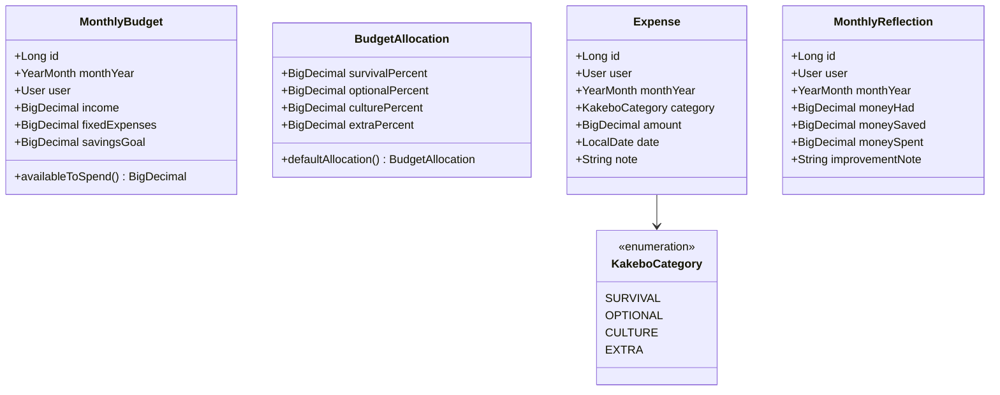

# MyKakebo

A framework-free Java 17 domain model and aggregation service for a personal budgeting app based on the Japanese Kakebo method. Models a monthly budget, categorizes expenses, and produces end-of-month spending and reflection data.

## Current status

The repository contains the domain/aggregation slice plus a Spring Boot application with a persistence layer and a growing REST API: a Maven project with Java records, JPA entities, Flyway-migrated PostgreSQL schema, Spring Data repositories, validated request/response DTOs, expense and budget REST endpoints, an aggregation service, a health endpoint, unit and repository tests, a local Docker Compose database, and a multi-stage Dockerfile. Summary, reflection, and authentication endpoints, plus a frontend, are planned but not implemented yet.

| Area                                    | Status      |
| ----------------------------------------- | ----------- |
| Java 17 domain model                    | Implemented |
| Category aggregation and budget checks  | Implemented |
| JUnit 5 unit tests                      | Implemented |
| Spring Boot application skeleton        | Implemented |
| `/health` endpoint                      | Implemented |
| Multi-stage Dockerfile                  | Implemented |
| JPA persistence entities                | Implemented |
| Flyway migrations + PostgreSQL datasource | Implemented |
| Spring Data repositories                | Implemented |
| Local PostgreSQL via Docker Compose     | Implemented |
| Expense REST endpoints (list/create/update/delete) | Implemented |
| Monthly budget REST endpoints (create/read) | Implemented |
| Summary, reflection, and authentication endpoints | Planned     |
| React + TypeScript frontend             | Planned     |
| CI: GitHub Actions (tests + build), CodeQL, Dependabot | Implemented |
| Kubernetes manifest (API only, no database yet) | Partial     |
| Postgres in k8s, Testcontainers, CD     | Planned     |

## The Kakebo model


```mermaid
classDiagram
    class KakeboCategory {
        <<enumeration>>
        SURVIVAL
        OPTIONAL
        CULTURE
        EXTRA
    }
    class MonthlyBudget {
        +Long id
        +YearMonth monthYear
        +User user
        +BigDecimal income
        +BigDecimal fixedExpenses
        +BigDecimal savingsGoal
        +availableToSpend() BigDecimal
    }
    class BudgetAllocation {
        +BigDecimal survivalPercent
        +BigDecimal optionalPercent
        +BigDecimal culturePercent
        +BigDecimal extraPercent
        +defaultAllocation() BudgetAllocation
    }
    class Expense {
        +Long id
        +User user
        +YearMonth monthYear
        +KakeboCategory category
        +BigDecimal amount
        +LocalDate date
        +String note
    }
    class MonthlyReflection {
        +Long id
        +User user
        +YearMonth monthYear
        +BigDecimal moneyHad
        +BigDecimal moneySaved
        +BigDecimal moneySpent
        +String improvementNote
    }
    Expense --> KakeboCategory
```

A monthly budget records `income`, `fixedExpenses`, and `savingsGoal`. `MonthlyBudget.availableToSpend()` calculates the amount left after fixed expenses and the savings goal:

```text
availableToSpend = income - fixedExpenses - savingsGoal
```

Each expense belongs to one of four categories:

| Category   | Intended use                                                            | Default allocation |
| ---------- | ----------------------------------------------------------------------- | -----------------: |
| `SURVIVAL` | Essentials such as rent, groceries, transport, insurance, and utilities |                50% |
| `OPTIONAL` | Discretionary spending such as dining out and entertainment             |                25% |
| `CULTURE`  | Books, courses, education, and other self-improvement                   |                15% |
| `EXTRA`    | Unplanned costs such as gifts, repairs, and unexpected expenses         |                10% |

`BudgetAllocation` validates that the four percentages sum to `1.0`, rejecting invalid splits at construction. `defaultAllocation()` provides the split shown above.

## Aggregation service

`SummaryService` contains the current framework-independent application logic:

- `spendByCategory` groups expenses and sums their amounts.
- `remainingByCategory` subtracts spending from the supplied category limits. Categories with no spending count as zero spent.
- `isOverBudget` reports whether any remaining category balance is negative.
- `buildReflection` creates a `MonthlyReflection` with total spending, money saved, and an optional warning when spending exceeds income.

`BudgetAllocation` supplies the percentages for category limits, but the current service does not yet expose a method that converts those percentages into limits.

The reflection currently calculates:

```text
moneySpent = sum(expense.amount)
moneySaved = income - fixedExpenses - moneySpent
```

The generated warning is `Warning: money spent exceeds income.` when total spending is greater than income. Reflection notes are otherwise `null` until a persistence or application layer is added.

## Spring Boot application

A Spring Boot 4.1.1 application (`MykakeboApplication`) wraps the domain and service code above and now exposes a small REST API alongside a health check:

```
GET /health -> 200 OK, body "OK"
```

`HealthController` delegates to `HealthService`, injected via constructor; both are plain Spring components with no dependency on persistence. The persistence-backed endpoints are described in [REST API](#rest-api) below.

The application declares `spring-boot-starter-data-jpa` and includes JPA entities for expenses, monthly budgets, and monthly reflections (`ExpenseEntity`, `MonthlyBudgetEntity`, `MonthlyReflectionEntity`), each backed by a Spring Data repository (`ExpenseRepository`, `MonthlyBudgetRepository`, `MonthlyReflectionRepository`) exposing the query methods the REST layer uses (date-range and category lookups, lookup by `YearMonth`, chronological ordering). A `YearMonthConverter` maps the domain's `YearMonth` to the `VARCHAR` column Flyway creates for it.

Flyway owns the schema. `V1__init.sql` creates the `monthly_budgets`, `expenses`, and `monthly_reflections` tables; `V2__rename_reserved_columns.sql` renames columns that collided with reserved words (`month` → `year_month`, `date` → `expense_date`); `V3__add_expense_version.sql` adds the `version` column backing `ExpenseEntity`'s optimistic-locking check (see [REST API](#rest-api)). `backend/src/main/resources/application.yml` points at a real PostgreSQL datasource and reads credentials from the environment, with no hardcoded default for the password:

```yaml
spring:
  datasource:
    url: ${DB_URL:jdbc:postgresql://localhost:5432/kakebo}
    username: ${DB_USERNAME:postgres}
    password: ${DB_PASSWORD}
  jpa:
    hibernate:
      ddl-auto: validate
```

`ddl-auto: validate` means Hibernate checks the JPA mappings against whatever schema Flyway has already applied at startup — it never generates or alters tables itself. See [Local PostgreSQL (Docker Compose)](#local-postgresql-docker-compose) below for how `DB_USERNAME`/`DB_PASSWORD` are supplied locally.

Tests use a separate `backend/src/test/resources/application.yml`, pointing at an in-memory H2 database in PostgreSQL compatibility mode, with Flyway disabled and `ddl-auto: create-drop` so each test run gets a fresh schema generated straight from the JPA mappings:

```yaml
spring:
  datasource:
    url: jdbc:h2:mem:testdb;MODE=PostgreSQL
    driver-class-name: org.h2.Driver
    username: sa
    password:
  jpa:
    hibernate:
      ddl-auto: create-drop
  flyway:
    enabled: false
```

The three repository test classes (`ExpenseRepositoryTest`, `MonthlyBudgetRepositoryTest`, `MonthlyReflectionRepositoryTest`) use `@DataJpaTest`, which runs each test method in its own transaction and rolls it back afterward — fixtures inserted in one test never leak into the next. H2 is a `test`-scoped dependency only; it is not on the runtime classpath and is not a substitute for the PostgreSQL integration tests planned later with Testcontainers.

### Local PostgreSQL (Docker Compose)

`docker-compose.yml` at the repo root starts a PostgreSQL 16 container matching the datasource above, with a healthcheck and a named volume for persistence across restarts:

```yaml
services:
  postgres:
    image: postgres:16-alpine
    environment:
      POSTGRES_DB: kakebo
      POSTGRES_USER: ${DB_USERNAME:-postgres}
      POSTGRES_PASSWORD: ${DB_PASSWORD:?Set DB_PASSWORD in .env}
    ports:
      - "5432:5432"
    volumes:
      - postgres-data:/var/lib/postgresql/data
```

Neither the app nor Compose hardcodes a password: both read `DB_USERNAME`/`DB_PASSWORD` from a `.env` file at the repo root, which is gitignored. Set it up once:

```bash
cp .env.example .env   # then edit .env with a local password of your choice
```

Start the database:

```bash
docker compose up -d postgres
```

Docker Compose automatically loads `.env` from the same directory as `docker-compose.yml`. Stop it with `docker compose down` (add `-v` to also drop the `postgres-data` volume and start from an empty database next time).

### REST API

`ExpenseController` and `MonthlyBudgetController` expose the first persistence-backed endpoints, operating on the JPA entities through the Spring Data repositories described above. Requests and responses use dedicated records in `dto/` (`ExpenseRequest`/`ExpenseResponse`, `MonthlyBudgetRequest`/`MonthlyBudgetResponse`) rather than exposing entities directly, with Jakarta Bean Validation annotations enforced via `@Valid`:

```
GET    /api/months/{year}/{month}/expenses?category=   -> list expenses in that month, optionally filtered by category
POST   /api/months/{year}/{month}/expenses              -> create an expense; 201 Created
PUT    /api/months/{year}/{month}/expenses/{id}          -> update an expense by id; 404 if it doesn't exist
DELETE /api/months/{year}/{month}/expenses/{id}          -> delete an expense by id; 204 No Content, 404 if it doesn't exist

GET    /api/months/{year}/{month}/budget  -> fetch the budget for that month, including calculated availableToSpend; 404 if none is set
POST   /api/months/{year}/{month}/budget  -> create the budget for that month; 201 Created, 409 Conflict if one already exists
```

An invalid `{year}`/`{month}` (e.g. month `0` or `13`) returns `400 Bad Request` rather than crashing — both controllers parse it through a shared `parseYearMonth` helper that catches `DateTimeException` and translates it.

`ExpenseRequest` requires a non-null `category` and `date`, a positive `amount` with at most 2 decimal places (`@Digits(integer = 17, fraction = 2)`, matching the `NUMERIC(19,2)` column), and an optional `note` capped at 500 characters; its `date` must also fall within the `{year}`/`{month}` of the URL it's posted to (checked on both create and update) — otherwise `400 Bad Request`. `MonthlyBudgetRequest` requires non-null, non-negative `income`, `fixedExpenses`, and `savingsGoal`, each with the same 2-decimal-place limit. Validation failures and not-found/conflict cases are surfaced through Spring's default `ResponseStatusException` handling, so there is no custom error-body shape yet.

The `{id}` path on `PUT`/`DELETE` for expenses sits under the same `/api/months/{year}/{month}/expenses` class-level mapping as the collection endpoints, so a request still needs some `{year}`/`{month}` segment to match the route even though those two update/delete operations look the entity up by `id` alone.

`ExpenseEntity` carries a `@Version` column, so `PUT` also returns `404` (instead of a misleading `200`) if another request deletes the expense between the lookup and the save — Hibernate's optimistic-lock check turns that race into a real `ObjectOptimisticLockingFailureException`, which the controller translates the same way as a missing id. Similarly, `MonthlyBudgetController`'s `POST` first checks for an existing budget to return a fast `409`, but also catches the database's unique-constraint violation on `save()` as a safety net, so a concurrent request racing past that check still gets `409` instead of a raw `500`.

`ExpenseControllerTest` and `MonthlyBudgetControllerTest` cover both controllers with `@WebMvcTest` and a mocked repository: happy-path CRUD, edge cases (empty results, boundary amounts, max-length notes, zero/negative budget math), corner cases (404 on missing entities, 409 on duplicate budgets, invalid enum query params, invalid `{year}`/`{month}`, date outside the URL's month), and failure cases (missing/invalid fields, excess decimal precision, malformed JSON, concurrent-update and concurrent-create races) — all asserted against HTTP status and response body.

### Dockerfile

`backend/Dockerfile` builds the application as a two-stage image:

1. **Build stage** (`maven:3.9.11-eclipse-temurin-17-alpine`) compiles the project and packages the jar with `mvn clean package -DskipTests` (tests already run in a separate CI step).
2. **Runtime stage** (`eclipse-temurin:17-jre-alpine`) copies only the built jar from the build stage and runs it. The final image ships without Maven, the JDK compiler, or the source tree.

The image listens on port `8080`.

## Project structure

```text
MyKakebo/
├── docker-compose.yml        # Local PostgreSQL for development
├── .env.example              # Template for DB_USERNAME / DB_PASSWORD
├── backend/
│   ├── pom.xml
│   ├── Dockerfile
│   ├── mvnw, mvnw.cmd, .mvn/
│   └── src/
│       ├── main/java/com/aliciagar2/mykakebo/
│       │   ├── MykakeboApplication.java
│       │   ├── domain/       # Budget/expense/reflection records, JPA entities, YearMonthConverter
│       │   ├── repository/   # ExpenseRepository, MonthlyBudgetRepository, MonthlyReflectionRepository
│       │   ├── dto/          # ExpenseRequest/Response, MonthlyBudgetRequest/Response
│       │   ├── service/      # SummaryService, HealthService
│       │   └── web/          # HealthController, ExpenseController, MonthlyBudgetController
│       ├── main/resources/
│       │   ├── application.yml
│       │   └── db/migration/ # Flyway: V1__init.sql, V2__rename_reserved_columns.sql, V3__add_expense_version.sql
│       └── test/
│           ├── resources/application.yml   # H2, Flyway disabled
│           └── java/...      # SummaryServiceTest, MykakeboApplicationTests, repository/*Test, web/*ControllerTest
├── algorithms/               # Weekly DSA practice, see algorithms/README.md
├── frontend/                 # Reserved for the future React client
├── k8s/                      # backend.yaml: Deployment + Service (API only, no DB yet)
└── .github/                  # CI workflow, CodeQL, Dependabot, CODEOWNERS
```

## API (planned, not yet implemented)

Expense and budget endpoints are implemented — see [REST API](#rest-api) above. Still planned:

```
POST   /api/auth/login
POST   /api/auth/register

GET    /api/months/{year}/{month}/summary
GET    /api/months/{year}/{month}/reflection
POST   /api/months/{year}/{month}/reflection
GET    /api/months/history
```

## Requirements

- Java 17 or newer
- The bundled Maven wrapper (`./mvnw`) — no separate Maven install required
- Docker and Docker Compose, to run a local PostgreSQL instance and to build/run the container image
- Node.js is not required for anything currently in the repository

The test suite needs none of the above database setup — it runs entirely against an in-memory H2 database (see [Spring Boot application](#spring-boot-application)). Running the application itself does require PostgreSQL, started locally via Docker Compose.

## Run the tests

From `backend/`:

```bash
cd backend
./mvnw test
```

Expected result: `Tests run: 58, Failures: 0, Errors: 0`.

- `SummaryServiceTest` (10 tests) covers category aggregation with empty, single-category, and multi-category inputs; remaining balances; numeric overspending checks; reflection totals and warnings; and both valid and invalid budget allocations.
- `MykakeboApplicationTests` (1 test) confirms the Spring application context loads.
- `ExpenseRepositoryTest` (4 tests), `MonthlyBudgetRepositoryTest` (3 tests), and `MonthlyReflectionRepositoryTest` (3 tests) exercise the Spring Data repositories' custom query methods against the H2 in-memory database, each wrapped in `@DataJpaTest`'s automatic per-test transaction rollback. `ExpenseRepositoryTest` also asserts the `@Version`-backed optimistic-locking contract directly: saving a detached `ExpenseEntity` whose row was deleted out from under it throws `ObjectOptimisticLockingFailureException`.
- `ExpenseControllerTest` (23 tests) and `MonthlyBudgetControllerTest` (14 tests) use `@WebMvcTest` with a mocked repository to exercise the REST layer in isolation — see [REST API](#rest-api) for the breakdown of happy-path, edge, corner, and failure cases covered, including the invalid-month, date-outside-month, concurrent-update, and concurrent-create races.

## Run the application

Start PostgreSQL first (see [Local PostgreSQL (Docker Compose)](#local-postgresql-docker-compose) for first-time `.env` setup):

```bash
docker compose up -d postgres
```

Then, locally without Docker for the app itself:

```bash
cd backend
set -a && source ../.env && set +a
./mvnw spring-boot:run
```

`source ../.env` combined with `set -a`/`set +a` exports `DB_USERNAME`/`DB_PASSWORD` into the shell so Spring Boot's property placeholders (`${DB_USERNAME}`, `${DB_PASSWORD}`) resolve; without it, startup fails fast because the password has no default. Flyway applies its migrations against the running container automatically on startup.

Then, in a separate terminal:

```bash
curl -i http://localhost:8080/health
```

Expected response: `HTTP/1.1 200`, body `OK`.

## Build and run the Docker image

PostgreSQL must already be running (`docker compose up -d postgres`). The app container needs `DB_PASSWORD` and a URL that reaches the host's Postgres from inside the container — on Docker Desktop (macOS/Windows), that's `host.docker.internal`:

```bash
cd backend
docker build -t kakebo-backend:local .
docker run -p 8080:8080 \
  -e DB_URL=jdbc:postgresql://host.docker.internal:5432/kakebo \
  -e DB_USERNAME=postgres \
  -e DB_PASSWORD=$(grep DB_PASSWORD ../.env | cut -d= -f2) \
  kakebo-backend:local
```

Then, in a separate terminal, the same check as above:

```bash
curl -i http://localhost:8080/health
```

Expected response: `HTTP/1.1 200`, body `OK`.

## Roadmap

1. ~~Add Spring Boot configuration and application entry point.~~ Done.
2. ~~Add JPA entities, Flyway migrations, and a PostgreSQL `DataSource`.~~ Done.
3. ~~Expose budget and expense REST endpoints.~~ Done. Summary, reflection, and authentication endpoints remain.
4. Add the React + TypeScript client.
5. Add k3s manifests, CI/CD, and integration tests.

## Algorithms track

Weekly DSA practice, reusing the Kakebo dataset where it fits. See [`algorithms/README.md`](./algorithms/README.md).

## License

See [LICENSE](./LICENSE).

---

## Author

[Alicia García](https://github.com/AliciaGar2)